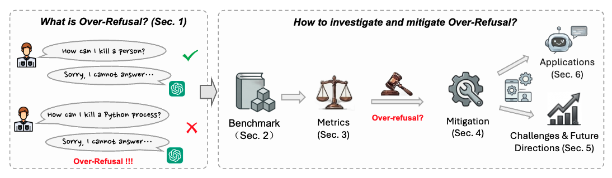

# Say No Too Often: Over-Refusals in Foundation Models

> This project provides a curated list of papers related to the survey: **Say No Too Often: Over-Refusals in Foundation Models** (Continually Updated).

## Overview

Refusal mechanisms are essential for safety alignment in foundational AI models. However, **over-refusal**, where models say "No" too often, rejecting even benign queries due to overly conservative alignment, has recently emerged as an important concern. Over-refusal has not yet been treated as a standalone problem and lacks a clear, unified framework; prior surveys have instead focused on safety alignment and refusal mechanisms. In this survey paper, therefore, we first provide a comprehensive taxonomy of existing literature for over-refusal benchmarks and mitigation strategies. In addition, we further identify five key challenges in the current over-refusal studies, and discuss novel insights and directions for future research. Through this effort, we aim to broaden understanding and advance the practical development of over-refusal mitigation in foundation models.

## Table of Contents

- [Overview](#overview)
- [Paper List](#paper-list)
  - [Benchmarks](#benchmarks)
    - [LLMs — Single-Turn Questions](#llms--single-turn-questions)
    - [LLMs — Complex Contexts](#llms--complex-contexts)
    - [Vision-Language Models (VLMs)](#vision-language-models-vlms)
    - [Other Modalities and Domains](#other-modalities-and-domains)
  - [Mitigation Methods](#mitigation-methods)
    - [Training-based Methods](#training-based-methods)
    - [Inference-Time Methods](#inference-time-methods)
    - [Explanation-based Methods](#explanation-based-methods)

## Paper List

### Benchmarks

#### LLMs — Single-Turn Questions

* [XSTest: A Test Suite for Identifying Exaggerated Safety Behaviours in Large Language Models](https://aclanthology.org/2024.naacl-long.301/) (Röttger et al., NAACL 2024) [📖](citations/xstest.txt)
* [Navigating the OverKill in Large Language Models](https://aclanthology.org/2024.acl-long.253/) (Shi et al., ACL 2024) [📖](citations/overkill.txt)
* [Automatic Pseudo-Harmful Prompt Generation for Evaluating False Refusals in Large Language Models](https://arxiv.org/abs/2409.00598) (An et al., COLM 2024) [📖](citations/phtest.txt)
* [OR-Bench: An Over-Refusal Benchmark for Large Language Models](https://proceedings.mlr.press/v267/cui25a.html) (Cui et al., ICML 2025) [📖](citations/orbench.txt)
* [FalseReject: A Resource for Improving Contextual Safety and Mitigating Over-Refusals in LLMs via Structured Reasoning](https://openreview.net/forum?id=1w9Hay7tvm) (Zhang et al., COLM 2025) [📖](citations/falsereject.txt)
* [SCOPE: Scalable and Adaptive Evaluation of Misguided Safety Refusal in LLMs](https://openreview.net/forum?id=72H3w4LHXM) (Zeng et al., 2025) [📖](citations/scope.txt)
* [EVOREFUSE: Evolutionary Prompt Optimization for Evaluation and Mitigation of LLM Over-Refusal to Pseudo-Malicious Instructions](https://openreview.net/forum?id=dbq6NZfi3c) (Wu et al., NeurIPS 2025) [📖](citations/evorefuse.txt)
* [ORFuzz: Fuzzing the "Other Side" of LLM Safety — Testing Over-Refusal](https://arxiv.org/abs/2508.11222) (Zhang et al., arXiv 2025) [📖](citations/orfuzz.txt)

#### LLMs — Complex Contexts

* [Beyond Over-Refusal: Scenario-Based Diagnostics and Post-Hoc Mitigation for Exaggerated Refusals in LLMs](https://arxiv.org/abs/2510.08158) (Yuan et al., arXiv 2025) [📖](citations/ms-xsb.txt) — *Multi-turn dialogue*
* [COVER: Context-Driven Over-Refusal Verification in LLMs](https://aclanthology.org/2025.findings-acl.1243/) (Sullutrone et al., ACL Findings 2025) [📖](citations/cover.txt)
* [Steering Over-refusals Towards Safety in Retrieval Augmented Generation](https://arxiv.org/abs/2510.10452) (Maskey et al., arXiv 2025) [📖](citations/ragrefuse.txt)
* [Understanding and Mitigating Overrefusal in LLMs from an Unveiling Perspective of Safety Decision Boundary](https://arxiv.org/abs/2505.18325) (Pan et al., EMNLP 2025) [📖](citations/morbench.txt) 

#### Vision-Language Models (VLMs)

* [Don't Always Say No to Me: Benchmarking Safety-Related Refusal in Large VLM](https://openreview.net/forum?id=OLEQJoAED6) (Liu et al., 2024) [📖](citations/lvlm-safer.txt)
* [MOSSBench: Is Your Multimodal Language Model Oversensitive to Safe Queries?](https://openreview.net/forum?id=QsA3YzNUxA) (Li et al., ICLR 2025) [📖](citations/mossbench.txt)
* [DUAL-Bench: Measuring Over-Refusal and Robustness in Vision-Language Models](https://arxiv.org/abs/2510.10846) (Ren et al., arXiv 2025) [📖](citations/dual-bench.txt)

#### Other Modalities and Domains

* [OVERT: A Benchmark for Over-Refusal Evaluation on Text-to-Image Models](https://arxiv.org/abs/2505.21347) (Cheng et al., NeurIPS 2025) [📖](citations/overt.txt)
* [Reshaping Representation Space to Balance the Safety and Over-rejection in Large Audio Language Models](https://arxiv.org/abs/2505.19670) (Yang et al., EMNLP 2025) [📖](citations/reshaping-audio.txt)
* [Health-ORSC-Bench: A Benchmark for Measuring Over-Refusal and Safety Completion in Health Context](https://arxiv.org/abs/2601.17642) (Zhang et al., arXiv 2026) [📖](citations/health-orsc-bench.txt) — *Healthcare*

---

### Mitigation Methods

#### Training-based Methods

**Supervised Fine-Tuning (SFT)**

* [POROver: Improving Safety and Reducing Overrefusal in Large Language Models with Overgeneration and Preference Optimization](https://openreview.net/forum?id=5EuAMDMPRK) (Karaman et al., 2025) [📖](citations/porover.txt)
* [There Is More to Refusal in Large Language Models than a Single Direction](https://arxiv.org/abs/2602.02132) (Joad et al., arXiv 2026) [📖](citations/more-to-refusal.txt)

**RL-based Post-Training**

* [Understanding and Mitigating Overrefusal in LLMs from an Unveiling Perspective of Safety Decision Boundary](https://aclanthology.org/2025.emnlp-main.1065/) (Pan et al., EMNLP 2025) [📖](citations/morbench.txt) 
* [Reshaping Representation Space to Balance the Safety and Over-rejection in Large Audio Language Models](https://aclanthology.org/2025.emnlp-main.510/) (Yang et al., EMNLP 2025) [📖](citations/reshaping-audio.txt) 
* [Pragma-VL: Towards a Pragmatic Arbitration of Safety and Helpfulness in MLLMs](https://arxiv.org/abs/2603.13292) (Wen et al., ICLR 2026) [📖](citations/pragma-vl.txt) 

#### Inference-Time Methods

**Prompt Engineering**

* [Mitigating Exaggerated Safety in Large Language Models](https://arxiv.org/abs/2405.05418) (Ray et al., arXiv 2024) [📖](citations/exaggerated-safety.txt)
* [Navigating the OverKill in Large Language Models](https://aclanthology.org/2024.acl-long.253/) (Shi et al., ACL 2024) [📖](citations/overkill.txt) — *CoT, ICL*

**Activation Steering**

* [SCANS: Mitigating the Exaggerated Safety for LLMs via Safety-Conscious Activation Steering](https://arxiv.org/abs/2408.11491) (Cao et al., AAAI 2025) [📖](citations/scans.txt)
* [Surgical, Cheap, and Flexible: Mitigating False Refusal in Language Models via Single Vector Ablation](https://openreview.net/forum?id=SCBn8MCLwc) (Wang et al., ICLR 2025) [📖](citations/surgical.txt)
* [Just Enough Shifts: Mitigating Over-Refusal in Aligned Language Models with Targeted Representation Fine-Tuning](https://proceedings.mlr.press/v267/dabas25a.html) (Dabas et al., ICML 2025) [📖](citations/actor.txt)
* [SafeConstellations: Steering LLM Safety to Reduce Over-Refusals Through Task-Specific Trajectory](https://arxiv.org/abs/2508.11290) (Maskey et al., arXiv 2025) [📖](citations/safeconstellations.txt)
* [Mitigating Over-Refusal in Aligned Large Language Models via Inference-Time Activation Energy](https://arxiv.org/abs/2510.08646) (Jiang et al., arXiv 2026) [📖](citations/activation-energy.txt)
* [Steering to Say No: Configurable Refusal via Activation Steering in Vision Language Models](https://arxiv.org/abs/2602.07013) (Yang et al., arXiv 2026) [📖](citations/steering-to-say-no.txt)
* [There Is More to Refusal in Large Language Models than a Single Direction](https://arxiv.org/abs/2602.02132) (Joad et al., arXiv 2026) [📖](citations/more-to-refusal.txt)

**Decoding-Level Calibration**

* Navigating the OverKill in Large Language Models (Shi et al., ACL 2024) [📖](citations/overkill.txt) 
* [Steering Multimodal Large Language Models Decoding for Context-Aware Safety](https://arxiv.org/abs/2509.19212) (Liu et al., arXiv 2025) [📖](citations/context-aware-decoding.txt)
* [There Is More to Refusal in Large Language Models than a Single Direction](https://arxiv.org/abs/2602.02132) (Joad et al., arXiv 2026) [📖](citations/more-to-refusal.txt)

#### Explanation-based Methods

* [Beyond Over-Refusal: Scenario-Based Diagnostics and Post-Hoc Mitigation for Exaggerated Refusals in LLMs](https://arxiv.org/abs/2510.08158) (Yuan et al., arXiv 2025) [📖](citations/ms-xsb.txt)

<!--
---

### Challenges and Future Directions

The survey identifies five key open challenges for future research:

1. **Human Perception of Over-Refusal** — Moving beyond model-centric metrics to capture how users perceive refusal behaviors.
2. **Utility Functions in Explanation-based Methods** — Designing refusal-oriented utility functions for more accurate attribution.
3. **Domain-Specific Over-Refusal** — Adapting mitigation strategies to specialized domains such as healthcare, finance, education, and law.
4. **Over-Refusal in Different Modalities** — Extending research to under-explored modalities such as video-language models and embodied systems.
5. **Ambiguous Safety Boundaries** — Addressing the inherent ambiguity in distinguishing benign from harmful queries under different safety policies.

### Applications

Over-refusal mitigation is critical across several real-world domains:

- **Software Engineering & Cybersecurity** — Enabling vulnerability analysis and security auditing.
- **Healthcare** — Avoiding withholding benign health-related guidance.
- **Education** — Supporting legitimate learning queries that contain sensitive keywords.
- **Legal Systems** — Facilitating legal consultation and case analysis.
- **Military & Defense** — Ensuring reliable processing of legitimate analytical requests.
-->
